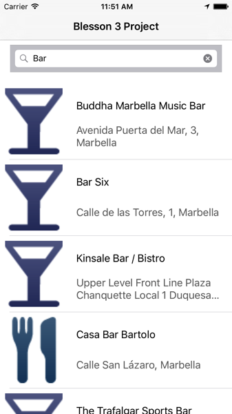
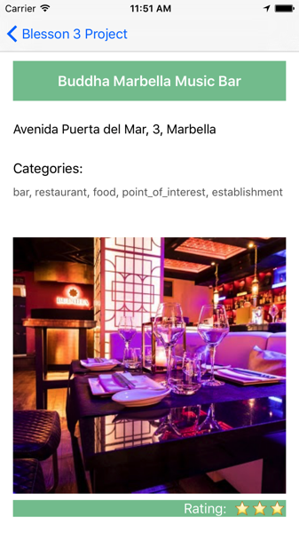

# Blesson 3 Project #

Proyecto a modo de prueba técnica para la empresa **Blesson 3**. 

Es un sencillo buscador de lugares, que llama a la API de Google Places, y las muestra en un tableView. Al hacer click sobre algún lugar, te lo muestra en detalle. He utilizado en esta ocasión el lenguaje `Swift 3`.

=================================

Project as a technical test for the company **Blesson 3**.

It's a simple place finder, which calls the Google Places API, and shows them in a tableView. When you click on a place, it shows you the detail view. I used the language `Swift 3` this time.

Para más información, visita mi blog: [www.oscargarrucho.com](http://oskarko.github.io/)